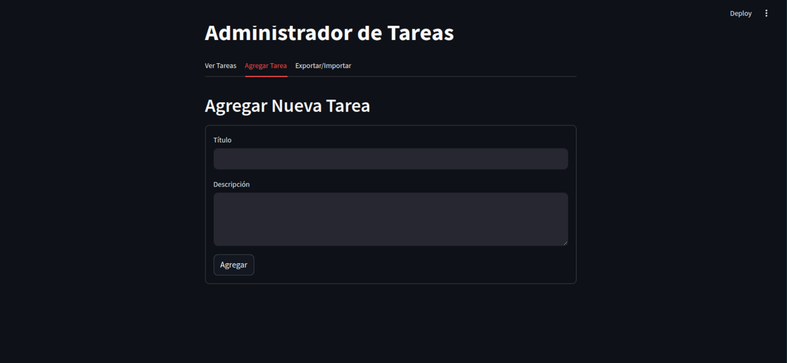

# Gestión de tareas
El aplicativo cumple con la administración y gestión de tareas en donde el usuario pueda crear, eliminar, actualizar, exportar y importar tareas.

## Librerías
El proyecto esta desarrollado usando StreamLit, usa como Base de Datos a SQLalchemy 

Para ejecutar el aplicativo se puede de manera local usando el comando streamliy run ./src/main.py o ejecutarlo en la nube por medio de GitHub.

**Se proyectan algunas muestras del aplicativo:**

### Desarrollo

